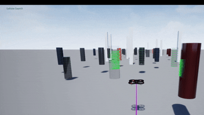
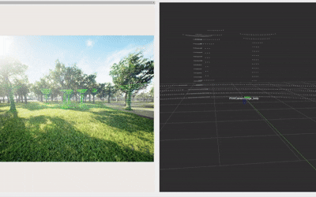
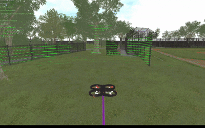
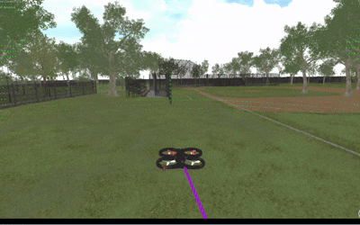
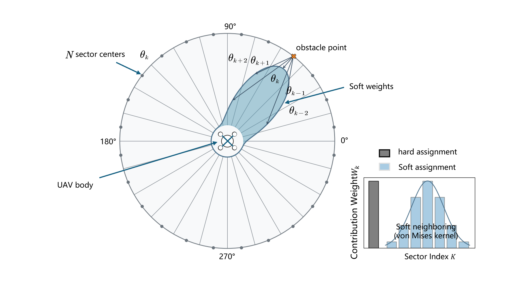
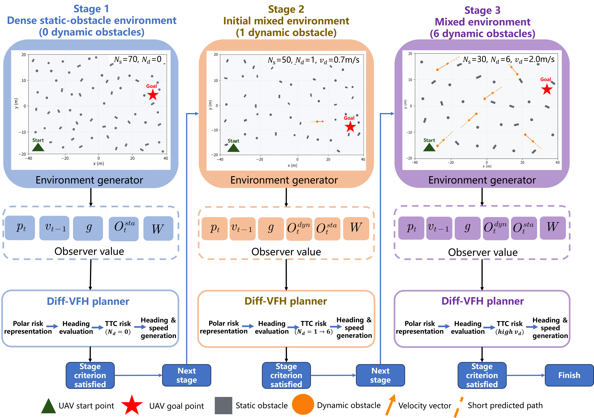

<div align="center">

# Diff-VFH

### A Differentiable and Interpretable Risk-Aware Histogram for UAV Dynamic Obstacle Avoidance

[](https://www.python.org/)
[](https://pytorch.org/)
[](https://microsoft.github.io/AirSim/)
[](https://www.unrealengine.com/)
[](LICENSE)

**Xinhao Yang**<sup>1,2</sup>, **Jinchen Zhao**<sup>1,2,\*</sup>, **Mian Ye**<sup>1,2,\*</sup>, Shirong Guo<sup>1</sup>, Junchen Pang<sup>1</sup>, Tianyi Xu<sup>1</sup>, Cheng Luo<sup>1</sup>

<sup>1</sup> School of Aerospace and Intelligent Equipment, Xihua University, Chengdu 610039, China<br>
<sup>2</sup> Engineering Research Center of Intelligent Space Ground Integration Vehicle and Control, Ministry of Education, Chengdu 610039, China<br>
<sup>\*</sup> Corresponding authors: `zhaojc@xhu.edu.cn`, `yemian@xhu.edu.cn`

---
<p align="center">
  Closed-loop UAV navigation examples using <b>Diff-VFH</b>.
  The demonstrations highlight the planner's real-time obstacle avoidance
  and risk-aware motion generation in representative environments.
</p>

<table align="center">
  <tr>
    <td width="50%" align="center" valign="top">
      
      <br>
      <b>Demo 1 — [Simple structured scene]</b>
      <br>
      <sub>[The drone avoided obstacles at high speed shown in GIF 1.]</sub>
    </td>
    <td width="50%" align="center" valign="top">
      
      <br>
      <b>Demo 2 — [The drone avoided obstacles at high speed]</b>
      <br>
      <sub>[Drones can successfully avoid tree obstacles in complex structured environments shown in GIF 2.]</sub>
    </td>
  </tr>

  <tr>
    <td width="50%" align="center" valign="top">
      
      <br>
      <b>Demo 3 — [The drone passes through a passage with obstacles]</b>
      <br>
      <sub>[The drone can avoid obstacles without shaking when passing through the passage shown in GIF 3.]</sub>
    </td>
    <td width="50%" align="center" valign="top">
      
      <br>
      <b>Demo 4 — [Drones pass through narrow passages]</b>
      <br>
      <sub>[The drone safely passed through a narrow passage without shaking. The exit width of the passage was only 1.2 times the size of the body shown in GIF 4.]</sub>
    </td>
  </tr>
</table>
<br>
---

</div>

<p align="center">
  
  <br>
  <em><b>Fig. 1</b> — Overall framework. Local UAV and obstacle states are transformed into a differentiable polar risk representation, followed by candidate-heading evaluation, dynamic-risk estimation, Softmin heading generation, and risk-aware speed regulation.</em>
</p>

---

## Overview

Safe autonomous navigation in cluttered, dynamic environments requires a UAV local planner that is fast, interpretable, and responsive to moving obstacles. Classical Vector Field Histogram (VFH) planners are attractive because they compress observations into a compact polar histogram with explicit geometric meaning — but they rely on hard sector assignment, binary occupancy thresholding, and discrete heading selection. These non-smooth operations produce abrupt commands, and more importantly they block gradient-based optimization of the planner's own parameters.

**Diff-VFH** replaces every non-differentiable stage of VFH with a continuous counterpart, so that a small set of physically meaningful parameters can be learned end-to-end by gradient descent while the planner keeps its geometric transparency. A finite-horizon closest-approach model additionally injects time-to-collision-style predictive risk into both heading selection and speed regulation.

> **Headline result.** Across 200 randomized trials per environment in AirSim / Unreal Engine 4, Diff-VFH reaches a **93.5%** success rate in the structured environment and **91.5%** in the high-fidelity forest environment — using parameters transferred directly from the differentiable simulator, without any environment-specific re-tuning.

<table>
<tr>
<td width="33%" align="center"><b>Differentiable</b><br><sub>Soft angular kernel, smooth occupancy, and continuous heading generation</sub></td>
<td width="33%" align="center"><b>Risk-aware</b><br><sub>Predicted encounter risk drives heading <i>and</i> speed together</sub></td>
<td width="33%" align="center"><b>Compact</b><br><sub>Only 11 learnable parameters, each with a physical meaning</sub></td>
</tr>
</table>

---

## Highlights

- **A fully differentiable VFH formulation.** Hard sector assignment becomes a normalized von Mises soft kernel, binary occupancy becomes a smooth sigmoid mapping, and discrete heading selection becomes a Softmin-weighted circular mean. Gradients flow end to end while explicit geometric decision variables are preserved.
- **Predictive heading–speed coupling.** A finite-horizon closest-approach model estimates encounter risk under several candidate speeds, so predicted conflicts change the commanded heading *before* an obstacle enters the immediate safety margin.
- **Compact and interpretable learning.** Instead of a high-dimensional control network, only 11 parameters — angular concentration, occupancy steepness and threshold, Softmin temperature, cost weights, and speed gating sensitivity — are optimized, each bounded to a physically meaningful interval.
- **Validated end to end.** Comparisons against APF, DWA and VFH+, comparisons against curriculum-augmented PPO, SAC and TD3, component ablations, and closed-loop AirSim validation in three Unreal Engine scenes.

---

## Method

### Differentiable polar risk representation

The heading space is divided into 72 uniformly spaced candidate directions. Rather than snapping each obstacle into one angular sector, Diff-VFH spreads its influence smoothly across neighbouring headings using a normalized von Mises kernel, then converts the resulting histogram intensity into a soft occupancy value through a sigmoid mapping. Obstacle influence decays with distance and grows moderately with obstacle size, and moving obstacles are conservatively inflated according to their current velocity so the planner reacts to them earlier.

<p align="center">
  
  <br>
  <em><b>Fig. 2</b> — von Mises soft assignment of one obstacle to neighbouring headings.</em>
</p>

<p align="center">
  
  
  <br>
  <em><b>Fig. 3</b> — Differentiable polar-risk construction. <b>(a)</b> geometric interpretation of the safety margin. <b>(b)</b> sigmoid conversion from histogram intensity to soft occupancy.</em>
</p>

### Predictive dynamic risk

Instantaneous clearance is not enough, because two currently separated bodies may still converge into a future conflict. Each candidate heading is therefore additionally evaluated under several normalized flight speeds. Assuming obstacle motion stays consistent over a short horizon, the planner computes when the UAV and each moving obstacle would come closest and how much surface clearance would remain at that moment. Headings that lead to a tight and imminent encounter receive a high directional risk, with an extra penalty triggered at close-range braking distance.

### Continuous heading and gated speed

Candidate direction costs combine goal alignment, soft occupancy, lateral clearance, command continuity, predicted dynamic risk, and two auxiliary terms that discourage outward motion near workspace boundaries and encourage recovery toward the goal after long detours. Instead of picking a single best sector, the costs are turned into a Softmin distribution and the reference heading is taken as a circular weighted mean — which also yields a directional confidence value. The reference speed is produced by multiplying several smooth gates that respond to clearance, occupancy, dynamic risk, directional ambiguity, terminal approach, and emergency braking, so heading and speed are regulated from the same risk information.

### Curriculum training

Trajectories are unrolled inside a differentiable PyTorch environment and the planner parameters are optimized by gradient descent over a three-stage curriculum of increasing difficulty: first dense static avoidance, then a progressive introduction of moving obstacles, and finally rising obstacle speed. Parameters are inherited between consecutive stages.

<p align="center">
  
  <br>
  <em><b>Fig. 4</b> — Curriculum-training framework.</em>
</p>

<p align="center">
  
  
  
  <br>
  <em><b>Fig. 5</b> — Training behaviour. (a) moving success and collision rates; (b) static-obstacle count across the curriculum; (c) max rollout-step statistics.</em>
</p>

The moving success rate reaches **98.7%** at the end of the first stage, dips slightly when dynamic obstacles are introduced, and recovers to **96.0%** — the compact parameter set adapts without any change to the planner structure, and each learned value remains readable as directional risk concentration, heading weighting, or speed sensitivity rather than as opaque network weights.

---

## Results

All results below are reported under the most demanding stress condition, which lies **beyond the training distribution** in both obstacle count and obstacle speed. Values are mean ± 95% confidence interval over five independent random seeds.

### Against conventional local planners

| Method | Success rate (%) ↑ | Collision rate (%) ↓ | Dynamic collision rate (%) ↓ | Path efficiency ↑ |
|:--|:--|:--|:--|:--|
| **Diff-VFH (ours)** | **98.60 ± 0.68** | **1.40 ± 0.68** | 1.50 ± 0.03 | **0.938 ± 0.010** |
| VFH+ | 87.80 ± 5.07 | 12.20 ± 5.07 | 12.20 ± 5.07 | 0.893 ± 0.003 |
| DWA | 91.60 ± 4.17 | 8.40 ± 4.17 | 4.40 ± 4.17 | 0.893 ± 0.015 |
| APF | 13.40 ± 3.58 | 86.60 ± 3.58 | 5.60 ± 4.78 | 0.690 ± 0.002 |

Diff-VFH leads on both reliability and path efficiency. Its inter-step command variation is larger than the baselines — the acknowledged trade-off of reacting quickly to rapidly changing risk.

### Against learning-based planners

| Method | Success rate (%) ↑ | Collision rate (%) ↓ | Dynamic collision rate (%) ↓ | Episodes to 90% success ↓ |
|:--|:--|:--|:--|:--|
| **Diff-VFH (ours)** | **98.60 ± 0.68** | **1.40 ± 0.68** | **1.50 ± 0.03** | **820 ± 90** |
| SAC+ | 94.60 ± 1.80 | 5.40 ± 1.80 | 2.80 ± 1.10 | 2400 ± 360 |
| TD3+ | 92.80 ± 2.10 | 7.20 ± 2.10 | 3.60 ± 1.40 | 2900 ± 410 |
| PPO+ | 90.80 ± 2.50 | 9.20 ± 2.50 | 5.40 ± 1.90 | 3600 ± 520 |

The “+” suffix marks baselines augmented with the same three-stage curriculum. Diff-VFH reaches a higher success rate with roughly **3–4× fewer** training episodes.

### Ablation of the main components

| Variant | Success rate (%) | Collision rate (%) | Dynamic collision rate (%) | Avg. speed (m/s) | Min. dynamic clearance (m) |
|:--|:--|:--|:--|:--|:--|
| **Full Diff-VFH** | **98.60 ± 0.68** | **1.40 ± 0.68** | **1.50 ± 0.03** | 3.822 ± 0.593 | 4.394 ± 0.523 |
| w/o dynamic braking | 93.20 ± 0.61 | 6.80 ± 0.61 | 2.58 ± 1.82 | 5.576 ± 0.183 | 6.645 ± 0.215 |
| w/o predictive direction risk | 91.90 ± 1.17 | 8.10 ± 1.17 | 3.36 ± 1.96 | 3.612 ± 0.122 | 3.771 ± 0.464 |
| w/o dynamic prediction loss | 91.76 ± 1.64 | 8.24 ± 1.64 | 5.16 ± 3.58 | 3.906 ± 0.016 | 4.717 ± 0.116 |
| w/o wall recovery | 75.08 ± 2.23 | 24.92 ± 2.23 | 13.96 ± 9.86 | 3.754 ± 0.053 | 5.733 ± 0.321 |

Removing predictive direction risk or the dynamic prediction loss raises dynamic collisions; disabling braking buys flight speed at the cost of safety; boundary recovery turns out to have the single largest effect on overall reliability.

---

## Closed-loop validation in AirSim / Unreal Engine

The learned parameters were transferred to AirSim without environment-specific re-optimization. Diff-VFH runs as the upper-level planner and emits horizontal velocity commands online, while the AirSim controller tracks them and holds altitude independently. Three Unreal Engine scenes were used: a **structured mixed-obstacle scenario** with dense static and dynamic obstacles (**93.5%** success over 200 trials), a **high-fidelity forest scenario** with irregular geometry and partial occlusion (**91.5%** success over 200 trials), and a **narrow-corridor fence scenario** used as a qualitative stress test under restricted free space.

<!-- ===================================================================
     DEMO GIFS — remove this comment block once the GIFs are uploaded.
     Upload the three files to  assets/gifs/  with exactly these names:
         structured_scene.gif
         forest_scene.gif
         narrow_corridor.gif
     Then delete the line starting with "<!--" above and the line
     ending with "-->" below, and the table will render.
     =================================================================== 

<table>
<tr>
<td width="50%" align="center">
  <br>
  <b>Structured mixed-obstacle scenario</b><br>
  <sub>Dense static and dynamic obstacles &nbsp;|&nbsp; <b>93.5%</b> success over 200 trials</sub>
</td>
<td width="50%" align="center">
  <br>
  <b>High-fidelity forest scenario</b><br>
  <sub>Irregular geometry and partial occlusion &nbsp;|&nbsp; <b>91.5%</b> success over 200 trials</sub>
</td>
</tr>
<tr>
<td colspan="2" align="center">
  <br>
  <b>Narrow-corridor fence scenario</b><br>
  <sub>Qualitative stress test under restricted free space</sub>
</td>
</tr>
</table>

-->

---

## Repository structure

```text
Diff-VFH-Relevant-codes-and-attachments/
├── assets/                # Figures and GIFs used by this README
│   ├── gifs/
│   └── *.png
├── diffvfh/               # Core differentiable planner
├── envs/                  # Differentiable PyTorch rollout environment
├── train/                 # Three-stage curriculum training
├── eval/                  # Randomized evaluation, baselines, ablations
├── airsim/                # Closed-loop AirSim bridge and scene configs
├── checkpoints/           # Trained parameter sets
├── requirements.txt
└── README.md
```

> **Note.** Only part of the source code and related materials are released here. Additional data or code needed to reproduce a specific experiment is available from the corresponding author on reasonable request.

---

## Experimental platform

| Component | Specification |
|:--|:--|
| Operating system | Windows 11 |
| Processor | Intel® Core™ Ultra 9 285H |
| Memory | 32 GB |
| Graphics card | NVIDIA GeForce RTX 5070, 8 GB VRAM |
| Deep learning framework | PyTorch 2.x |
| Simulator | AirSim 1.8.1 |
| Rendering engine | Unreal Engine 4.27.2 |

---

## Getting started

```bash
git clone https://github.com/SJ-YXH/Diff-VFH-Relevant-codes-and-attachments.git
cd Diff-VFH-Relevant-codes-and-attachments

conda create -n diffvfh python=3.9 -y
conda activate diffvfh
pip install -r requirements.txt
```

Train the planner through the curriculum:

```bash
python train/train_curriculum.py
```

Run randomized evaluation with a trained parameter set:

```bash
python eval/evaluate.py --ckpt checkpoints/diffvfh_final.pt
```

Run the closed-loop AirSim demo — launch the Unreal Engine project first, copy `airsim/settings.json` to `~/Documents/AirSim/settings.json`, then:

```bash
python airsim/run_diffvfh_airsim.py --ckpt checkpoints/diffvfh_final.pt --scene forest
```

---

## Limitations

- Planning is performed in the horizontal plane under altitude-controlled flight; fully three-dimensional planning is left to future work.
- Moving obstacles are assumed to keep a consistent velocity within the short prediction horizon, so highly erratic or strongly interactive agents may degrade performance.
- Inter-step command variation is higher than that of the smoother baselines; temporal command smoothing remains an open improvement.
- Validation is currently simulation-based — physical flights under sensing noise and control delay have not yet been carried out.

---

## Citation

If this work is useful to your research, please cite:

```bibtex
@article{yang2025diffvfh,
  title   = {Diff-VFH: A Differentiable and Interpretable Risk-Aware Histogram for UAV Dynamic Obstacle Avoidance},
  author  = {Yang, Xinhao and Zhao, Jinchen and Ye, Mian and Guo, Shirong and Pang, Junchen and Xu, Tianyi and Luo, Cheng},
  journal = {},
  year    = {2025}
}
```

## Acknowledgements

This research was funded by the Open Research Subject of the Engineering Research Center of Intelligent Space Ground Integration Vehicle and Control (Xihua University), Ministry of Education, grant **ZNKD2024-002**, and the Sichuan Province “Jie Bang Gua Shuai” Technology Plan Project, grant **2023YFG0377**.

We thank the authors of [AirSim](https://github.com/microsoft/AirSim) and [PyTorch](https://pytorch.org/) for their open-source tools.

## License

Released under the [MIT License](LICENSE).

## Contact

Questions and issues are welcome via [GitHub Issues](https://github.com/SJ-YXH/Diff-VFH-Relevant-codes-and-attachments/issues), or by email to the corresponding authors: `zhaojc@xhu.edu.cn` / `yemian@xhu.edu.cn`.

