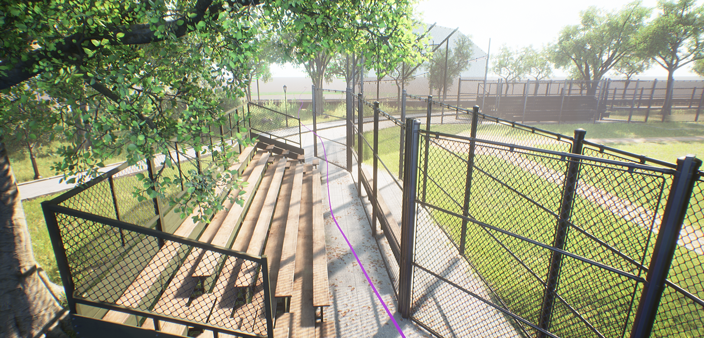

# Diff-VFH-Relevant-codes-and-attachments
Our paper continuously softens the key links of the classic VFH, enabling some parameters of the VFH to participate in gradient propagation, making it more adaptable to complex environments

> The relevant file codes are as follows：
1. Training code：Diff_train_.py
2. The trained model file：stage3_diff_vfh.pth
